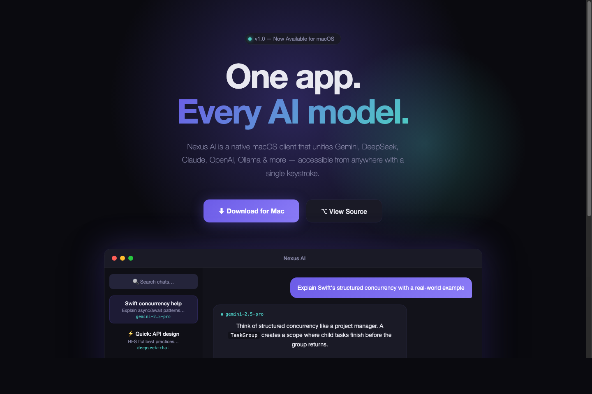

# Nexus AI

  

A native macOS AI chat client with multi-model support, system-level integration, and privacy-first design.

## Features

### Multi-Model Support
Connect to multiple AI providers from a single interface:
- **Google Gemini** — chat, vision, image generation
- **DeepSeek** — fast, affordable text chat
- **Claude** (Anthropic) — advanced reasoning
- **OpenAI** — GPT models with vision and DALL-E
- **Ollama** — local models, fully offline
- **OpenRouter, Perplexity, xAI** — and more

### macOS Native Experience
- **MenuBar app** — always one click away
- **Global hotkey (⌥Space)** — Spotlight-like Quick Panel for instant AI access
- **File drag & drop** — drop code, text, PDFs directly into Quick Panel
- **Clipboard monitoring** — detect new clipboard content, one-click analyze
- **Apple Shortcuts** — Ask AI, Summarize, Translate in automation workflows
- **Privacy Mode** — force all traffic through local Ollama, data never leaves your Mac

### Chat Features
- Streaming responses with Markdown rendering
- Code syntax highlighting (Fira Code)
- AI Personas with custom system prompts
- PDF and image attachments
- Chat search and history
- iCloud sync (optional)
- Voice input (Speech-to-Text) and Text-to-Speech

## Requirements
- macOS 14.0 (Sonoma) or later
- Apple Silicon (arm64)

## Quick Start
1. Clone this repo
2. Open `NexusAI.xcodeproj` in Xcode
3. Build and run
4. Add your API keys in Settings → API Services
5. Press `⌥Space` anywhere to start chatting

## API Setup

| Provider | Get API Key | Free Tier? |
|----------|------------|:---:|
| Gemini | [Google AI Studio](https://aistudio.google.com/app/apikey) | ✅ |
| DeepSeek | [DeepSeek Platform](https://platform.deepseek.com/) | Limited |
| Claude | [Anthropic Console](https://console.anthropic.com/) | ❌ |
| OpenAI | [OpenAI Platform](https://platform.openai.com/) | ❌ |
| Ollama | [ollama.com](https://ollama.com/) | ✅ Local |

## Acknowledgments

Nexus AI is a derivative work based on [macai](https://github.com/Renset/macai) by **Renat Notfullin**, licensed under the Apache License 2.0.

Third-party dependencies: Highlightr, Sparkle, SwiftMath, KeychainAccess, FiraCode.

## License

Copyright 2025 K1vin
Copyright 2024 Renat Notfullin

Licensed under the Apache License, Version 2.0. See [LICENSE.md](LICENSE.md) for details.
